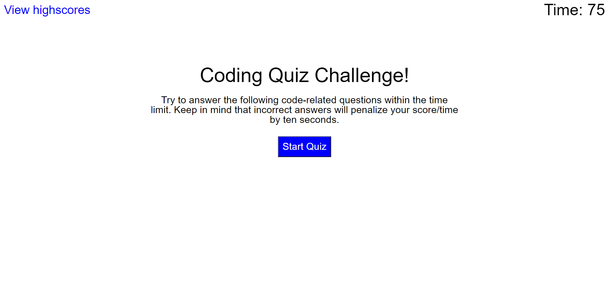
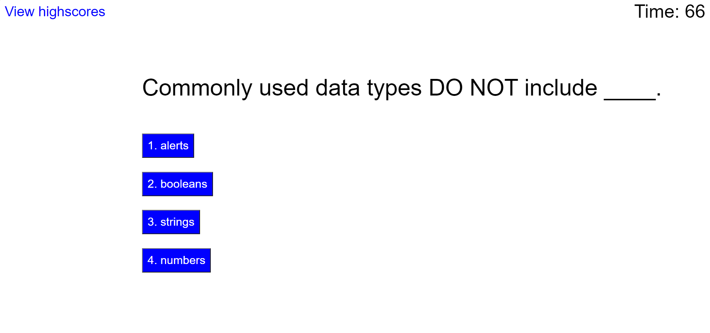
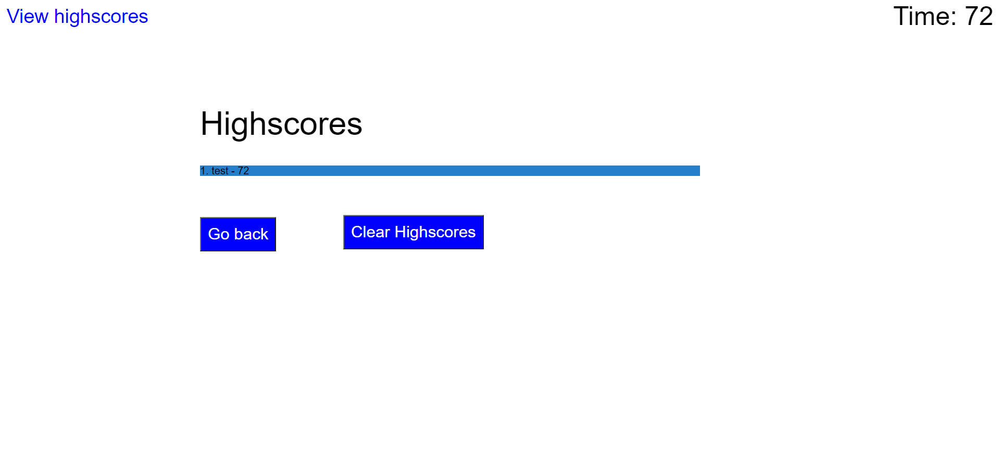

# Quiz Question Game

## Description

    The motivation for this project was to create a web page that can generate several question that you must answer correctly and get the highest score. The reason for this project was to apply the knowledge learn with web API using javascrip so far in the class. I learn that for every project there alwasys a better or shorter way to get to the same answer you just need to look for it a make it apply it to your project in one way or another. 

## Usage

    On the webpage you will see an set of instructions for when you start the quiz game, on the middle of the screen you will see an button that will start the questions, on the top left corner the is another button that when click you will see all the high scores saved and lastly on the top right corner there is a timer that will start to count down from 75 sec at the moment you click the start button. When the start button is click the timer starts to count down and the questions display one by one with mutiple choise if you anser it incorrectly you will be penalize with minus 10 sec, after answering all the questions it will ask you to put your initials and it will get your score from the time left on the timer to submit it to the highscore page. On the highscore page you will see all the score saved and aslo there will appear two more buttons in the middle of the display, on of the when click it will get you back to the main page with the instructions and the other one will erase all the score saved.

## Links & Screenshots
 * [Quiz Question Game Web Page](https://arielo5.github.io/Quiz_Question_Game/)

 * Screenshots of the web pages

    

    

    

 ## Repo Content
* css (folder)
    * style.cdd
    * reset.cdd
* images (folder)
* javascript (folder)
    * scrips.js 
* README.md
* index.html

